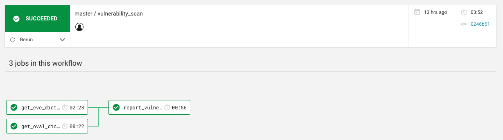

# VurcleCI

VurcleCI is continuous **vu**lnerability scanning on Ci**rcleCI**.

## Usage

1. `$ git clone https://github.com/lorentzca/vurcleci.git`
2. Edit `.circleci/config.yml`.
3. Push and follow repository on CircleCI.
